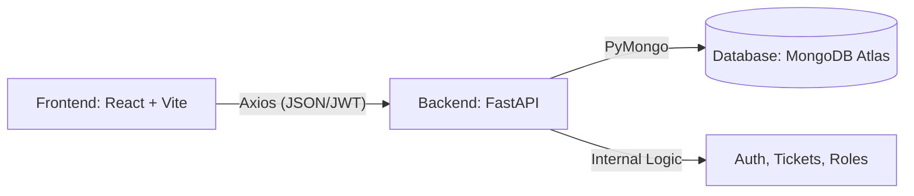

# 🌐 Digital Complaint Management System (DCMS) - Project Overview

The Digital Complaint Management System (DCMS) is a professional-grade, full-stack application designed to streamline the reporting, tracking, and resolution of maintenance issues within a structured environment (such as a university or corporate office).

---

## 🎯 Project Mission

To provide a transparent, efficient, and user-friendly platform where:

- **Students** can report issues without friction.
- **Staff** can manage their maintenance workload with clarity.
- **Admins** have absolute oversight and control over the ecosystem.

---

## 🏗️ System Architecture

DCMS is built as a **Decoupled Monorepo**, ensuring a clean separation between the user interface and the business logic:



- **Frontend**: A high-performance SPA (Single Page Application) deployed on **Vercel**.
- **Backend**: A scalable, async Python API deployed on **Render**.
- **Database**: A globally distributed NoSQL database for flexible data storage.

---

## 💎 Feature Matrix by Role

### 🎓 Student Features

- **Registration & Login**: Secure access to the portal.
- **Complaint Submission**: Create tickets with titles, descriptions, and categories.
- **Media Support**: Ability to attach images to provide visual context for issues.
- **Personal Dashboard**: Track the status (Open, In Progress, Resolved) of all submitted complaints.

### 🛠️ Maintenance Staff Features

- **Task Queue**: View a dedicated list of tickets assigned specifically to them by an Admin.
- **Live Status Updates**: Change ticket status as they work on the resolution.
- **Resolution Communication**: Add comments or notes upon resolving a ticket.

### 🛡️ System Admin Features

- **Global Oversight**: Access a master dashboard showing every ticket in the system.
- **User Management**: Add or remove students and staff members to maintain community safety.
- **Ticket Assignment**: Assign incoming complaints to the most relevant staff members.
- **Bulk Operations**: Clean up the system efficiently with multi-select ticket deletion.
- **Real-time Analytics**: Quick view of system health and ticket distributions.

---

## 📁 Global Project Structure

```text
DCMTS/
├── backend/                # FastAPI Application (Python)
│   ├── app/                # Core logic, routes, and services
│   ├── .env.example        # Template for backend secrets
│   └── requirements.txt    # Python dependencies
├── frontend/               # React + Vite Application (JavaScript)
│   ├── src/                # Components, Pages, and Global State
│   ├── .env.example        # Template for frontend variables
│   └── package.json        # JS dependencies
├── docs/                   # Detailed Technical Guides
│   ├── BACKEND_GUIDE.md    # Deep dive into API logic
│   ├── FRONTEND_GUIDE.md   # Deep dive into UI logic
│   └── DEPLOYMENT.md       # How to host the system
└── LICENSE                 # MIT License (Copyright 2026 RENIL)
```

---

## 🚀 Key Technologies

| Layer        | Technology           | Reason                                                    |
| :----------- | :------------------- | :-------------------------------------------------------- |
| **Backend**  | FastAPI              | High speed, automatic documentation, and type safety.     |
| **Frontend** | React 18             | Component-based architecture for a dynamic UI.            |
| **Styling**  | Vanilla CSS + Tokens | Maximum control over premium aesthetics and theme tokens. |
| **Database** | MongoDB              | Flexible schema for evolving complaint types.             |
| **Security** | JWT + Bcrypt         | Industry standard for secure, stateless sessions.         |
